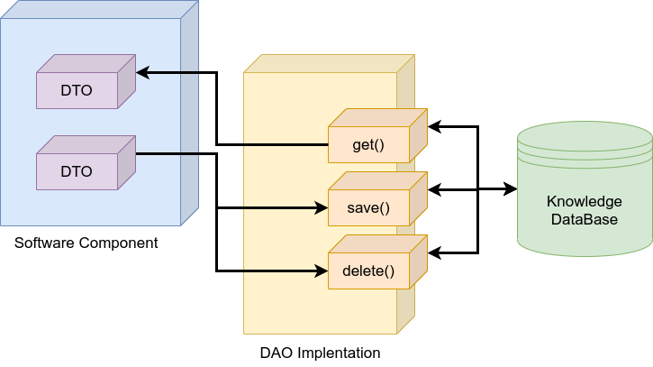

# KANT (Knowledge mAnagemeNT)

<p align="center">
  
</p>

This is a Python tool to manage knowledge. It is based on several software design patterns (DTO, DAO, Factory).

- property deleters in DTO
- "ontology" basic class: save, get, save property

## Table of Contents

1. [Features](#features)
2. [Installation](#installation)
   - [MongoDB](#mongodb)
   - [Mongo Compass (Optional)](#mongo-compass-optional)
   - [KANT](#kant)
3. [Demos](#demos)

## Features



There are two DAO families implemented:

- `MONGO`: this is a DAO family that uses MongoDB to storage the knowledge. Besides, the Mongoengine Python library is used to access MongoDB.

Elements (DTOs) that can be used are:

- types
- objects
- fluents (bool and numeric)
- facts
- goals
- actions (and durative)

## Installation

### MongoDB

```shell
$ wget -qO - https://www.mongodb.org/static/pgp/server-4.4.asc | sudo apt-key add -
$ sudo apt-get install gnupg
$ wget -qO - https://www.mongodb.org/static/pgp/server-4.4.asc | sudo apt-key add -
$ echo "deb [ arch=amd64,arm64 ] https://repo.mongodb.org/apt/ubuntu focal/mongodb-org/4.4 multiverse" | sudo tee /etc/apt/$ sources.list.d/mongodb-org-4.4.list
$ sudo apt-get update
$ sudo apt-get install -y mongodb-org
$ sudo systemctl start mongod
```

### Mongo Compass (Optional)

https://docs.mongodb.com/compass/master/install/

### KANT

```shell
$ git git@github.com:mgonzs13/kant_core.git
$ cd ~/kant_core
$ sudo python3 setup.py install
```

## Demos

```python
#!/usr/bin/env python3

from kant.kant_dao import (
    DaoFactoryMethod,
    DaoFamilies
)

from kant.kant_dto import (
    TypeDto,
    ObjectDto,
    FluentDto,
    FactDto,
    ConditionEffectDto,
    ActionDto
)

DaoFactoryMethod(DaoFamilies.MONGO, uri="mongodb://localhost:27017/kant")
dao_factory = DaoFactoryMethod.get_dao_factory()

# creating DAOs
type_dao = dao_factory.create_type_dao()
object_dao = dao_factory.create_object_dao()
fluent_dao = dao_factory.create_fluent_dao()
fact_dao = dao_factory.create_fact_dao()
action_dao = dao_factory.create_action_dao()

# types
robot_type = TypeDto("robot", father=TypeDto("object"))
wp_type = TypeDto("wp")

# fluent
robot_at = FluentDto(
    "robot_at", [robot_type, wp_type])
battery_level = FluentDto(
    "battery_level", [robot_type], is_numeric=True)

# objects
rb1 = ObjectDto(robot_type, "rb1")
wp1 = ObjectDto(wp_type, "wp1")
wp2 = ObjectDto(wp_type, "wp2")

# facts
robot_at_fact = FactDto(robot_at, [rb1, wp1])
battery_level_fact = FactDto(battery_level, [rb1], value=10.0)
goal_dto = FactDto(robot_at, [rb1, wp2], is_goal=True)

# actions
r = ObjectDto(robot_type, "r")
s = ObjectDto(wp_type, "s")
d = ObjectDto(wp_type, "d")

condition_1 = ConditionEffectDto(battery_level,
                                 [r],
                                 time=ConditionEffectDto.AT_START,
                                 value=5.0,
                                 condition_effect=ConditionEffectDto.GREATER)

condition_2 = ConditionEffectDto(robot_at,
                                 [r, s],
                                 time=ConditionEffectDto.AT_START,
                                 value=True)

effect_1 = ConditionEffectDto(robot_at,
                              [r, s],
                              time=ConditionEffectDto.AT_START,
                              value=False)

effect_2 = ConditionEffectDto(robot_at,
                              [r, d],
                              time=ConditionEffectDto.AT_END,
                              value=True)

effect_3 = ConditionEffectDto(battery_level,
                              [r],
                              time=ConditionEffectDto.AT_END,
                              value=4.75,
                              condition_effect=ConditionEffectDto.DECREASE)


action_dto = ActionDto(
    "navigation", [r, s, d],
    [condition_1, condition_2],
    [effect_1, effect_2, effect_3])

# saving all
object_dao.save(rb1)
object_dao.save(wp1)
object_dao.save(wp2)

fact_dao.save(robot_at_fact)
fact_dao.save(battery_level_fact)
fact_dao.save(goal_dto)

action_dao.save(action_dto)
```
