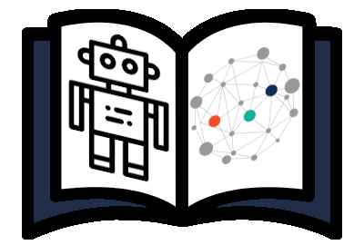

# KANT (Knowledge mAnagemeNT)

<p align="center">
  
</p>

This is a Python tool to manage knowledge. It is based on several software design patterns (DTO, DAO, Factory).

## Table of Contents

1. [Features](#features)
2. [Installation](#installation)
   - [MongoDB](#mongodb)
   - [Mongo Compass (Optional)](#mongo-compass-optional)
   - [KANT](#kant)
3. [Tests](#tests)
4. [Demos](#demos)
5. [Citations](#citations)

## Features


There are two DAO families implemented:

- `MONGO`: this is a DAO family that uses MongoDB to storage the knowledge. Besides, the Mongoengine Python library is used to access MongoDB.

Elements (DTOs) that can be used are:

- types
- objects
- fluents (bool and numeric)
- facts
- goals
- actions (and durative)

## Installation

### MongoDB

```shell
$ wget -qO - https://www.mongodb.org/static/pgp/server-5.0.asc | sudo apt-key add -
$ echo "deb [ arch=amd64,arm64 ] https://repo.mongodb.org/apt/ubuntu focal/mongodb-org/5.0 multiverse" | sudo tee /etc/apt/sources.list.d/mongodb-org-5.0.list
$ sudo apt-get update
$ sudo apt-get install -y mongodb-org
$ sudo service mongod start
```

### Mongo Compass (Optional)

https://docs.mongodb.com/compass/master/install/

### KANT

```shell
$ git git@github.com:mgonzs13/kant_core.git
$ cd ~/kant_core
$ sudo python3 setup.py install
```

## Tests

```shell
$ sudo service mongod start
$ python3 setup.py pytests
```

## Demos

```python
#!/usr/bin/env python3

from kant.kant_dao import (
    DaoFactoryMethod,
    DaoFamilies
)

from kant.kant_dto import (
    TypeDto,
    ObjectDto,
    FluentDto,
    FactDto,
    ConditionEffectDto,
    ActionDto
)

DaoFactoryMethod(DaoFamilies.MONGO, uri="mongodb://localhost:27017/kant")
dao_factory = DaoFactoryMethod.get_dao_factory()

# creating DAOs
type_dao = dao_factory.create_type_dao()
object_dao = dao_factory.create_object_dao()
fluent_dao = dao_factory.create_fluent_dao()
fact_dao = dao_factory.create_fact_dao()
action_dao = dao_factory.create_action_dao()

# types
object_type = TypeDto("object")
robot_type = TypeDto("robot", father=object_type)
wp_type = TypeDto("wp")

# fluent
at = FluentDto(
    "at", [object_type, wp_type])
battery_level = FluentDto(
    "battery_level", [robot_type], is_numeric=True)

# objects
rb1 = ObjectDto(robot_type, "rb1")
wp1 = ObjectDto(wp_type, "wp1")
wp2 = ObjectDto(wp_type, "wp2")

# facts
at_fact = FactDto(at, [rb1, wp1])
battery_level_fact = FactDto(battery_level, [rb1], value=10.0)
goal_dto = FactDto(at, [rb1, wp2], is_goal=True)

# actions
r = ObjectDto(robot_type, "r")
s = ObjectDto(wp_type, "s")
d = ObjectDto(wp_type, "d")

condition_1 = ConditionEffectDto(battery_level,
                                 [r],
                                 time=ConditionEffectDto.AT_START,
                                 value=5.0,
                                 condition_effect=ConditionEffectDto.GREATER)

condition_2 = ConditionEffectDto(at,
                                 [r, s],
                                 time=ConditionEffectDto.AT_START,
                                 value=True)

effect_1 = ConditionEffectDto(at,
                              [r, s],
                              time=ConditionEffectDto.AT_START,
                              value=False)

effect_2 = ConditionEffectDto(at,
                              [r, d],
                              time=ConditionEffectDto.AT_END,
                              value=True)

effect_3 = ConditionEffectDto(battery_level,
                              [r],
                              time=ConditionEffectDto.AT_END,
                              value=4.75,
                              condition_effect=ConditionEffectDto.DECREASE)


action_dto = ActionDto(
    "navigation", [r, s, d],
    [condition_1, condition_2],
    [effect_1, effect_2, effect_3])

# saving all
object_dao.save(rb1)
object_dao.save(wp1)
object_dao.save(wp2)

fact_dao.save(at_fact)
fact_dao.save(battery_level_fact)
fact_dao.save(goal_dto)

action_dao.save(action_dto)
```

## Citations

```bibtex
@InProceedings{10.1007/978-3-031-06527-9_45,
    author="Gonz{\'a}lez-Santamarta, Miguel {\'A}.
    and Rodr{\'i}guez-Lera, Francisco J.
    and Mart{\'i}n, Francisco
    and Fern{\'a}ndez, Camino
    and Matell{\'a}n, Vicente",
    editor="Ferr{\'a}ndez Vicente, Jos{\'e} Manuel
    and {\'A}lvarez-S{\'a}nchez, Jos{\'e} Ram{\'o}n
    and de la Paz L{\'o}pez, F{\'e}lix
    and Adeli, Hojjat",
    title="KANT: A Tool for Grounding and Knowledge Management",
    booktitle="Bio-inspired Systems and Applications: from Robotics to Ambient Intelligence",
    year="2022",
    publisher="Springer International Publishing",
    address="Cham",
    pages="452--461",
    abstract="The roboticist community divides the knowledge representation and decision-making in the symbolic and sub-symbolic fields. Thus, real-world robotics grounded representation requires specific software techniques for landing continuous and discrete state variables in both fields. This research designs and develops an Open Source tool called KANT (Knowledge mAnagemeNT). It will be used to translate sub-symbolic properties and attributes from the robot environment to a symbolic paradigm in the Knowledge Base, in particular to PDDL. Based on Python, KANT includes mechanisms to enhance the process of knowledge manipulation in real-world scenarios through the use of in-memory or non-SQL databases, which would mean a time enhancement of around 30{\%} of total time in middleware such as ROS 2.",
    isbn="978-3-031-06527-9"
}
```

```bibtex
@misc{https://doi.org/10.48550/arxiv.2204.08495,
    doi = {10.48550/ARXIV.2204.08495},
    url = {https://arxiv.org/abs/2204.08495},
    author = {González-Santamarta, Miguel Á. and Rodríguez-Lera, Francisco J. and Martín, Francisco and Fernández, Camino and Matellán, Vicente},
    keywords = {Robotics (cs.RO), FOS: Computer and information sciences, FOS: Computer and information sciences},
    title = {KANT: A tool for Grounding and Knowledge Management},
    publisher = {arXiv},
    year = {2022},
    copyright = {Creative Commons Attribution Non Commercial No Derivatives 4.0 International}
}
```
